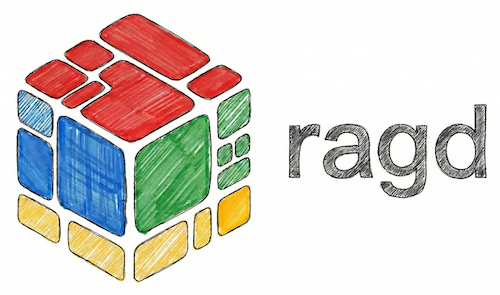
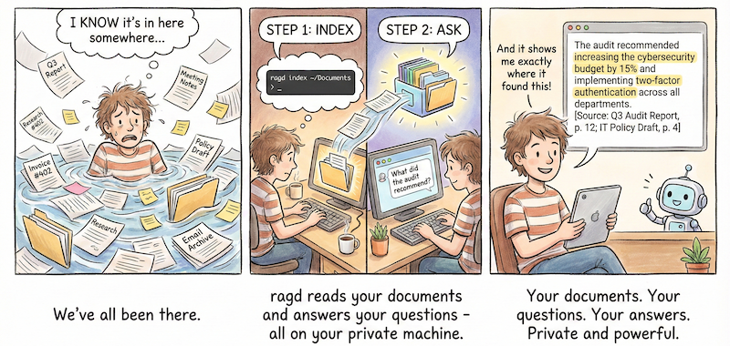

[](https://www.python.org/downloads/)
[](https://github.com/REPPL/ragd/releases)
[](https://ollama.ai/)
[]()
[]()
[](https://claude.ai/code)

> **Note:** ragd is currently under active development. If you need a working RAG solution today, consider these excellent alternatives:
>
> **Local-First (Privacy-Focused):**
> - [PrivateGPT](https://github.com/zylon-ai/private-gpt) - Local document Q&A, OpenAI-compatible API
> - [AnythingLLM](https://anythingllm.com/) - Desktop app with built-in RAG and agents
> - [GPT4All](https://gpt4all.io/) - One-click install, no GPU required
> - [Khoj](https://khoj.dev/) - Personal AI "second brain" with Obsidian integration
>
> **Managed Service:**
> - [Needle](https://needle.app/) - Enterprise RAG-as-a-Service with 25+ app connectors
>
> See [Alternative Projects](docs/explanation/alternatives.md) for a detailed comparison.




## Your Private Intelligent Document Assistant

`ragd` is a local RAG *(Retrieval-Augmented Generation)* system that lets you ask questions about your documents and get accurate answers with citations -- all while keeping your data completely private and local.



*[Generated](docs/assets/prompts/getting-started-comic.md) by Gemini 3, cropped. Inspiration: [here](https://youtu.be/rX4PzvWgu6c).*

## Overview

ragd is a reference implementation demonstrating best practices for:
- **Local-first, privacy-preserving AI** - All processing happens on your machine
- **Hardware-aware optimisation** - Automatic tuning for Apple Silicon, CUDA, or CPU
- **CLI-first applications** with Typer + Rich
- **Feature-centric documentation**

## Quick Start

### Prerequisites
- [Python 3.12](https://www.python.org/downloads/release/python-3120/)
- [Ollama](https://ollama.ai/) (for LLM inference)

### Installation

```bash
# Create a virtual environment (recommended)
python3.12 -m venv ~/.ragd-env
source ~/.ragd-env/bin/activate  # On Windows: .ragd-env\Scripts\activate

# Downgrade pip (required due to bug in pip 24.1+)
pip install pip==24.0

# Install ragd from GitHub
pip install git+https://github.com/REPPL/ragd.git
```

> **Note:** The pip downgrade is required due to a [breaking change in packaging 24.0](https://packaging.pypa.io/en/stable/changelog.html)
> (bundled with pip 24.1+) that causes `InvalidVersion` errors when evaluating optional dependency markers.

Then run the guided setup:

```bash
ragd init     # Detects hardware, recommends models
ragd doctor   # Verify installation and show feature status
```

#### Expert Installation (Minimal)

For CI pipelines or resource-constrained environments:

```bash
# Install core features only (smaller footprint)
RAGD_MINIMAL=1 pip install git+https://github.com/REPPL/ragd.git
```

### Contributing

See [CONTRIBUTING.md](CONTRIBUTING.md) for development setup instructions.

## Usage

```bash
# Show available commands
ragd --help

# Example commands (when implemented)
ragd index <path>      # Index documents
ragd search <query>    # Search indexed documents
ragd chat              # Interactive chat with context
```

## Documentation

- [Documentation Hub](docs/README.md)
- [Tutorials](docs/tutorials/)
- [Guides](docs/guides/)
- [Reference](docs/reference/)

## Development

- [Development Documentation](docs/development/)
- [Feature Roadmap](docs/development/features/)
- [Architecture Decisions](docs/development/decisions/adrs/)

## AI Transparency

This project is developed with AI assistance. See [AI Contributions](docs/development/ai-contributions.md) for transparency documentation.

